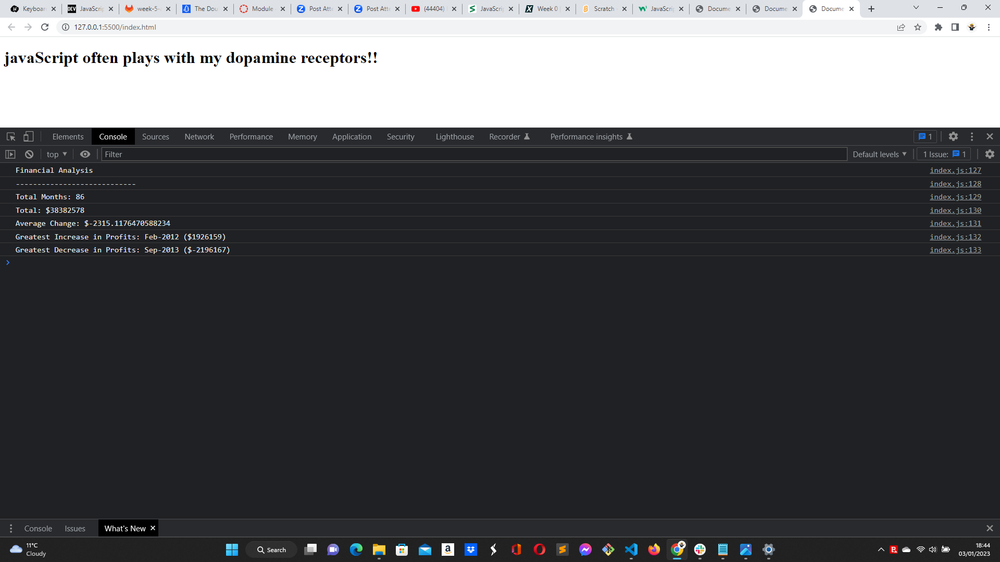

# Console Finances

## Website link: https://mister-stan.github.io/Console-Finances/

## 

## https://mister-stan.github.io/Console-Finances/

## This is a website built using HTML and javaScript. The javaScript code analyzes the financial records of a company and calculate different parameters. This file is part of bootcamp's console finances exercise which is delivered by Trilogy Education Services, an affiliate of edX.

## Built with:HTML and javaScript

## Installation N/A

## Credits https://skillsforlife.edx.org/

## License MIT 
